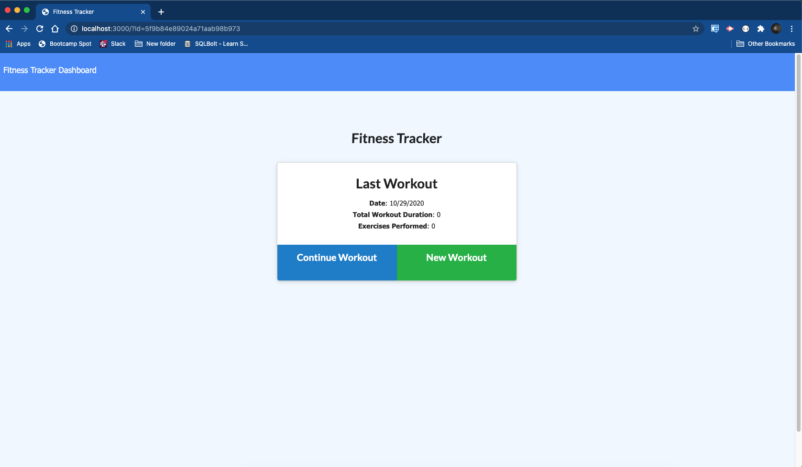
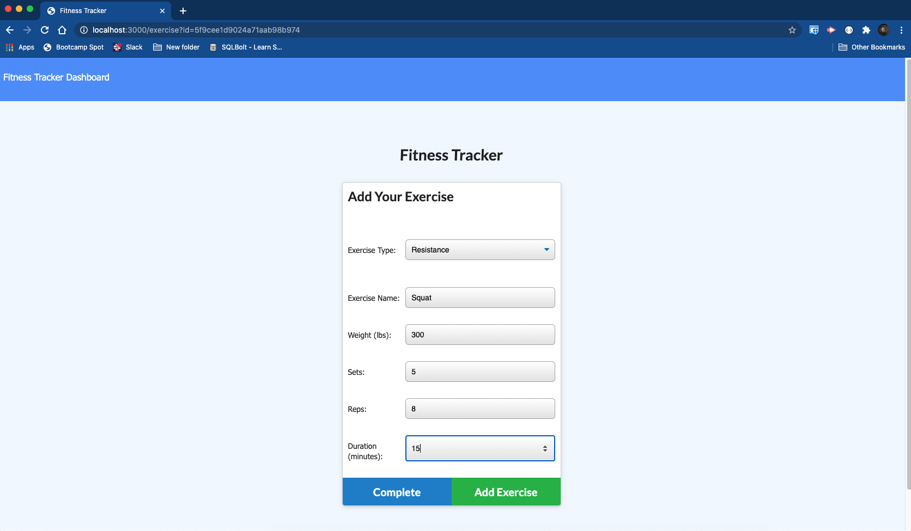
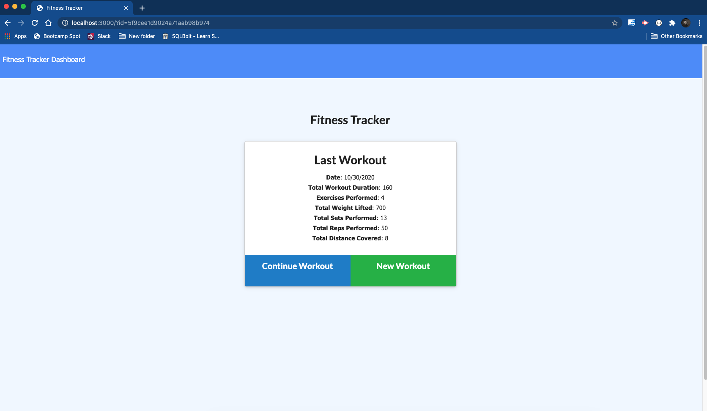

# Wourkout Tracker Homework 17  

## Introduction  

This assignment was given to create a workout tracker app that would log multipule excersises in a day of a workout. It would log the name, type, weight, sets, reps, and duration of exercise. For cardio, it would log distance traveled. This assignment used a NoSQL database, MongoDB, as the storage database.

## Table of Contents:  
* [Objectives](#Objectives)
* [Process](#Process)
* [Challenges](#Challenges)
* [Summary](#Summary)
* [Sites](#Sites)
* [Screenshots](#Screenshots)

## Objectives  

```md
When the user loads the page, they should be given the option to create a new workout or continue with their last workout.

The user should be able to:

  * Add exercises to a previous workout plan.

  * Add new exercises to a new workout plan.

  * View the combined weight of multiple exercises on the `stats` page.
```

## Process  

* I copied the homework into my own repository.  
* Then I did the "npm i" installation into my repository.  
* A lot of code was given to us for the assignment. I added the server.js, routing, seeding, and model pages.   

## Challenges  

This assignment was challenging for me. Understanding the fundamentals of backend development and storage is something I will be diving into very heavily to get better at. 

## Summary  

This assignment was a good reminder to continue the practice of backend work. 

## Sites  

* [Link to repository on GitHub](https://github.com/killerkyle/fitnessTracker)  

* [Link to deployed Heroku Website](https://desolate-chamber-65063.herokuapp.com)  

## Screenshots  

 
  
  